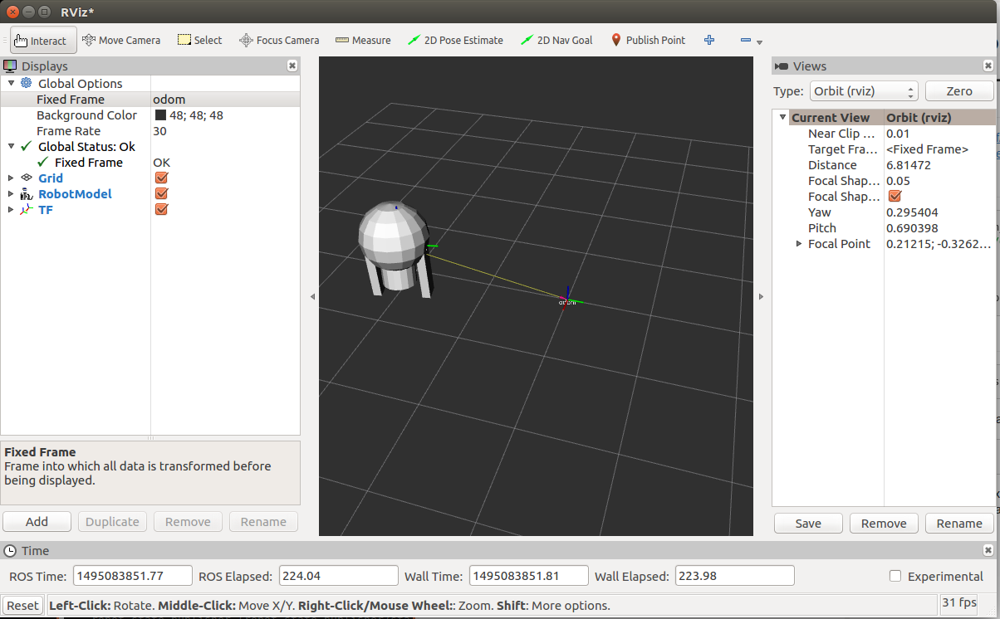

# ROS Tutorial: Using urdf with robot_state_publisher

## Reference
* http://wiki.ros.org/urdf/Tutorials/Using%20urdf%20with%20robot_state_publisher

## Environment
* Ubuntu 16.04 Xenial
* ROS Kinetic

## Build
```
$ cd /path/to/catkin_ws/src
$ git clone https://github.com/BaronYSYong/r2d2.git
$ cd ..
$ catkin_make
$ source devel/setup.bash
```

## Launch
```
$ roslaunch r2d2 display.launch
```
Run rviz in a new terminal using:
```
$ rosrun rviz rviz
```
Choose odom as your fixed frame (under Global Options). Then choose "Add Display" and add a Robot Model Display and a TF Display
 
